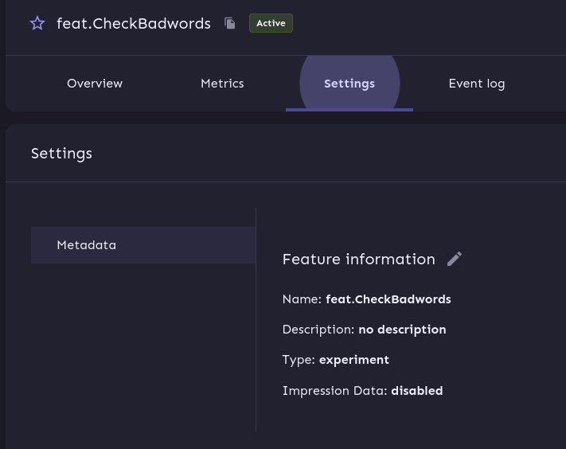
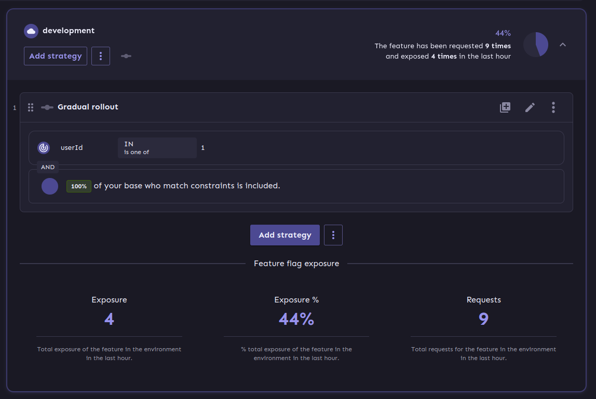

= Showcase for feature flags

This project is a showcase for feature flags

== Modules

- *infrastructure* - Showcase for arc42
- *todo-service-unleash* - Showcase for Unleash on GinGonic +Updated  Golang

== How to use

Once the infrastructure is set up the examples requires the creation of a
feature flag called `app.NewHello` with a proper deployment strategy.

It pretty much works with every default, it just has to be set up like this:

And a simple distribution strategy like this:

The endpoint provides a different route aptly named hello to answer with well
a hello:

[source,shell]
----
$ make hello
{
  "hello": "Hey!"
}
----

The activation can be done via webinterface:

And after a short delay to propagate the changes the hello changes slightly:

[source,shell]
----
$ make hello
{
  "hello": "Howdie!"
}
----

== Links

- https://github.com/Unleash/unleash
- https://www.getunleash.io/
- https://featureflagsbook.com/
